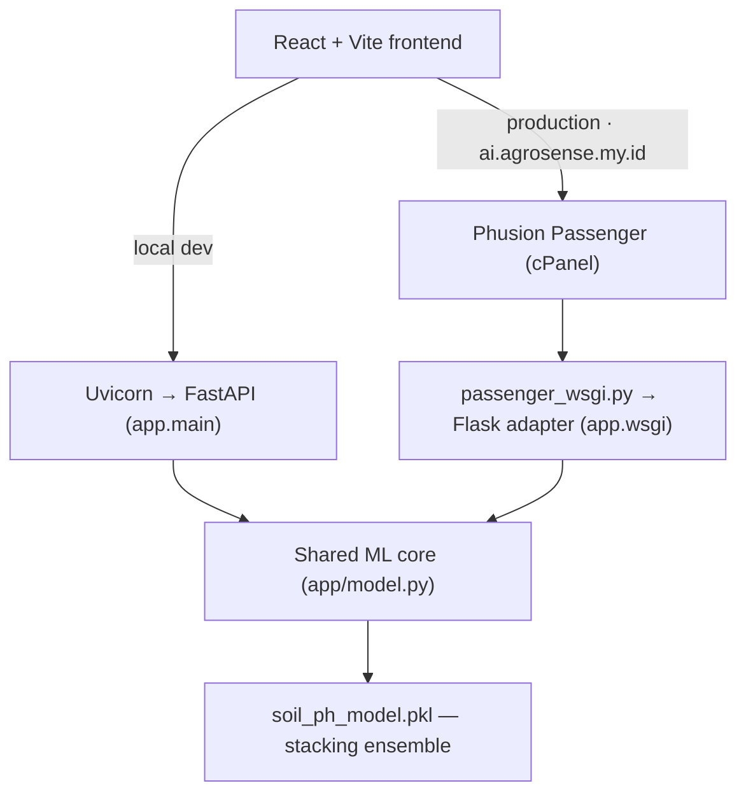

# AgroSense

    

**AI-Assisted Soil Health Support for Sustainable Agriculture.**

AgroSense is an AI web application that classifies soil pH into five agronomic bands (Strongly Acidic, Moderately Acidic, Neutral, Moderately Alkaline, and Strongly Alkaline) based on soil measurements which includes texture, nutrients, exchangeable base cations, and soil chemistry metrics. AgroSense also pairs each prediction with an interpretation of what each pH band implies for nutrient availability and soil management which help users create agricultural decisions. It works on a single sample or on a whole field uploaded as CSV. [Click Here](https://agrosense.my.id) to access the website!

---

## 🌱 Background

Healthy soil is fundamental to agricultural productivity. Around 95% of the world's food is produced in soil, yet approximately one-third of global soils are already degraded. Among the many indicators of soil condition, pH plays a particularly important role because it directly influences nutrient availability, microbial activity, and the toxicity of elements such as aluminium and manganese.

The impact is not merely theoretical. Around 40% of global arable land is estimated to be acidic, making soil acidity a widespread constraint on crop production. A global meta-analysis covering 832 observations from 142 studies found that amendments applied to acidic soils increased crop yields by approximately 36% on average, with the response becoming greater as initial soil pH declined. These findings highlight how identifying and managing unsuitable soil pH can directly influence agricultural productivity.

Assessing soil condition, however, is not always immediately actionable. Conventional soil analysis requires representative sampling, laboratory measurements, and interpretation of multiple chemical indicators. Laboratory turnaround can also take several days, while measurements such as nutrient levels, exchangeable cations, CEC, SAR, and ESP may be difficult to interpret together without sufficient agronomic knowledge.

AgroSense was developed as an AI-assisted decision-support tool for this gap. Using soil measurements that may already be available from a soil analysis, its trained ensemble model estimates the soil's pH category and presents the result together with prediction confidence and an accessible agronomic interpretation. AgroSense is designed to support faster interpretation and prioritisation of soil conditions — not to replace laboratory soil testing.

---

## 🗂️ Project Structure

```
AgroSense/
├── frontend/                        React + Vite single-page application
│   ├── src/
│   │   ├── components/              Input cards, result panel, batch upload, pH scale
│   │   ├── data/constants.js        Field ranges, tooltips, per-class interpretations
│   │   ├── utils/                   Range/texture validation, base-cation percentages
│   │   ├── api.js                   Client for /predict and /predict/batch
│   │   └── App.jsx                  Single/batch mode shell
│   ├── .env.example                 VITE_API_URL
│   └── package.json
├── backend/
│   ├── app/
│   │   ├── main.py                  FastAPI (ASGI) application — primary backend
│   │   ├── wsgi.py                  Flask WSGI adapter exposing the same routes
│   │   ├── model.py                 Shared ML core: load, feature assembly, predict
│   │   ├── schemas.py               Pydantic request/response models and validation
│   │   ├── constants.py             pH labels and feature/column ordering
│   │   ├── config.py                Environment-driven settings
│   │   └── routers/                 health.py, predict.py
│   ├── models/
│   │   └── soil_ph_model.pkl        Trained stacking ensemble (joblib)
│   ├── passenger_wsgi.py            cPanel/Passenger entrypoint
│   ├── requirements.txt             Local development / ASGI dependencies
│   └── requirements-cpanel.txt      Production (Passenger/WSGI) dependencies
├── Dataset/
│   ├── Train Set.csv                3,022 soil samples with pH class labels
│   └── Test Set.csv                 1,007 unlabelled samples
├── Notebook/
│   └── Soil pH Predictor Notebook.ipynb    Full ML workflow
└── README.md
```

---

## ✨ Key Features

| Feature | Description |
| --- | --- |
| **Single-sample prediction** | Twelve soil measurements — texture (sand/silt/clay), nutrients (N, P), base chemicals (Ca, Mg, K, Na), and soil metrics (CEC, SAR, ESP) — classified into one of five pH bands from strongly acidic to strongly alkaline. |
| **Prediction confidence** | The ensemble's probability for the predicted class, shown numerically and positioned on a five-band pH scale. |
| **Agronomic interpretation** | Each class carries an explanation of what typically drives it, how it affects nutrient availability, and which amendment approach applies. |
| **Base-cation saturation** | % Ca, % Mg, % K, and % Na are computed from the entered cations and updated live; the first three are fed to the model as engineered features. |
| **Batch CSV prediction** | Download a column template, drop in a CSV, and get a per-row class and confidence, a class-distribution summary, a preview table, and a full results CSV export. |
| **Input validation** | Per-field agronomic ranges and a sand + silt + clay = 100% check in the browser and in the Pydantic schema; batch uploads are checked for missing columns, non-numeric values, and incomplete rows, with the offending row numbers reported. |
| **Measurement guidance** | Inline tooltips document every input's unit, measurement method, valid range, and agronomic role. |
| **Health endpoint** | `GET /health` reports whether the model artifact loaded and surfaces the load error if it did not. |

---

## 🛠️ Tech Stack

### Frontend

- React 19
- Vite
- Tailwind CSS v4 (`@tailwindcss/vite`)
- ESLint

### Backend

- Python
- FastAPI — primary ASGI application
- Uvicorn — local development server
- Pydantic v2 — request validation and response models
- python-multipart — CSV upload handling
- python-dotenv — environment configuration
- Flask — production WSGI compatibility adapter only
- Flask-Cors

### Machine Learning

- scikit-learn 1.7.2 — `StackingClassifier`, `RandomForestClassifier`, `MLPClassifier`, `LogisticRegression`, `StandardScaler`, `Pipeline`
- XGBoost 3.3.0
- pandas
- NumPy
- joblib — model serialisation and loading
- imbalanced-learn, matplotlib, seaborn — notebook only, for training and analysis

### Deployment

- AnyMHost / cPanel — production hosting
- Phusion Passenger — production WSGI application server
- Static Vite build served at `agrosense.my.id`
- API served at `ai.agrosense.my.id`

---

## 🏗️ System Architecture

The frontend is a static React build that calls a single REST API — `POST /predict`, `POST /predict/batch`, and `GET /health` — at the base URL given by `VITE_API_URL`. The backend exposes those routes through two interchangeable web layers that both delegate to the same ML core in `backend/app/model.py`, which loads the joblib artifact once at startup, assembles the feature frame, and returns labels with probabilities.



FastAPI is the primary backend implementation and the target for local development, where Uvicorn also serves the generated OpenAPI docs at `/docs`. The production host runs Phusion Passenger, which starts WSGI applications rather than ASGI ones. Instead of rewriting the service, `app/wsgi.py` re-exposes the same routes as a thin Flask application reusing the same model core, schemas, and constants, and `passenger_wsgi.py` mounts it as the Passenger entrypoint. The Flask layer adds no prediction logic of its own — it only translates requests and errors between Flask and the shared core.

`passenger_wsgi.py` also pins the BLAS/OpenMP thread counts to one and enables `AGROSENSE_LIMIT_PARALLELISM`, which forces `n_jobs=1` on the ensemble's estimators so the model stays within the process and memory limits of shared hosting. Allowed browser origins are configured through `CORS_ORIGINS` in both layers.

### Machine Learning Layer

The served artifact is a scikit-learn `StackingClassifier` combining three base learners — a standardised multi-layer perceptron (256×128), a random forest (300 trees, depth 10, balanced class weights), and an XGBoost classifier (300 estimators) — under a logistic-regression meta-learner trained with 5-fold stratified cross-validation.

It takes fourteen features: the eleven measured inputs `P, SAND, CLAY, N, K, Ca, Mg, Na, CEC, SAR, ESP` plus the engineered base-cation saturations `% Ca, % Mg, % K` (silt is collected in the form for the texture check but was dropped during feature selection). Output is one of five ordinal pH classes (strongly acidic → strongly alkaline), with the class probability returned as the confidence score. On the held-out split of the balanced training data, the final tuned ensemble reaches 0.89 accuracy and 0.89 macro F1.

Data exploration, outlier handling, imputation, feature engineering and selection, the model experiments, and the full evaluation are documented in `Notebook/Soil pH Predictor Notebook.ipynb`.

---

## 💻 Local Setup

**Clone**

```bash
git clone https://github.com/utinn/AgroSense---AI-Assisted-Soil-Health-Support-for-Sustainable-Agriculture.git
cd AgroSense---AI-Assisted-Soil-Health-Support-for-Sustainable-Agriculture
```

**Backend**

```bash
cd backend
python -m venv .venv
source .venv/bin/activate        # Windows: .venv\Scripts\activate
pip install -r requirements.txt
cp .env.example .env
uvicorn app.main:app --reload
```

The API comes up on `http://127.0.0.1:8000`, with interactive docs at `/docs`. Run Uvicorn from `backend/` so the default relative `MODEL_PATH` resolves. Use `requirements.txt` for local work — `requirements-cpanel.txt` targets the production Passenger environment and installs Flask instead of FastAPI/Uvicorn.

**Frontend**

```bash
cd frontend
npm install
npm run dev
```

Vite serves the app on `http://localhost:5173`.

**Environment variables**

- `backend/.env.example` → `MODEL_PATH` (path to the joblib artifact, relative to `backend/`), `CORS_ORIGINS` (comma-separated allowed origins, already set to the two Vite localhost origins), and `AGROSENSE_LIMIT_PARALLELISM` (single-threaded estimators; keep `false` locally).
- `frontend/.env.example` → `VITE_API_URL`, which points at the production API. For local development, leave it unset so the client falls back to `http://localhost:8000`, or set it explicitly to your local backend.

No secrets are required to run the project locally.

---

## ⚠️ Limitations

- **Decision support, not a soil test.** The model predicts a pH *band*, not a numeric pH value, and it depends on lab-measured inputs — CEC, SAR, ESP, and exchangeable cations all come from a soil analysis to begin with. It narrows down what a soil is likely doing; it does not replace laboratory testing.
- **Training distribution is narrow and imbalanced.** The training file holds 3,022 rows skewed roughly 6:1 toward the majority class (1,290 moderately alkaline against 215 strongly acidic), with no recorded provenance for region or soil type. Rows beyond a z-score of 4 were filtered out during training, so genuinely extreme soils are outside the fitted range.
- **Reported metrics are optimistic.** Random oversampling is applied before the train/validation/test split, so duplicated minority samples can appear on both sides of it. The 0.89 accuracy therefore describes the balanced training distribution rather than unseen field data, and the bundled `Test Set.csv` is unlabelled, leaving no independent hold-out in the repository.
- **Adjacent bands are the weak point.** In the final model, moderately alkaline has the lowest recall (0.72); most errors are confusions between neighbouring pH bands rather than gross misclassifications.
- **Stateless service.** There is no authentication, rate limiting, or persistence — nothing submitted is stored, batch uploads are processed entirely in memory, and CSV size is bounded only by the request limits of the host.

---

## 🚀 Future Improvements

- Evaluate on a genuinely held-out, non-oversampled split, and move imbalance handling inside the cross-validation folds so reported metrics reflect unseen data.
- Add a numeric pH regression output alongside the five-band classifier, so users get a value as well as a category.
- Generate per-prediction feature attributions (e.g. SHAP) so the interpretation reflects what actually drove that sample's prediction rather than fixed per-class text.
- Broaden the training data with additional labelled sources covering more regions and soil types, particularly the underrepresented acidic classes.
- Add streaming or chunked handling and an explicit row cap for large batch uploads.
