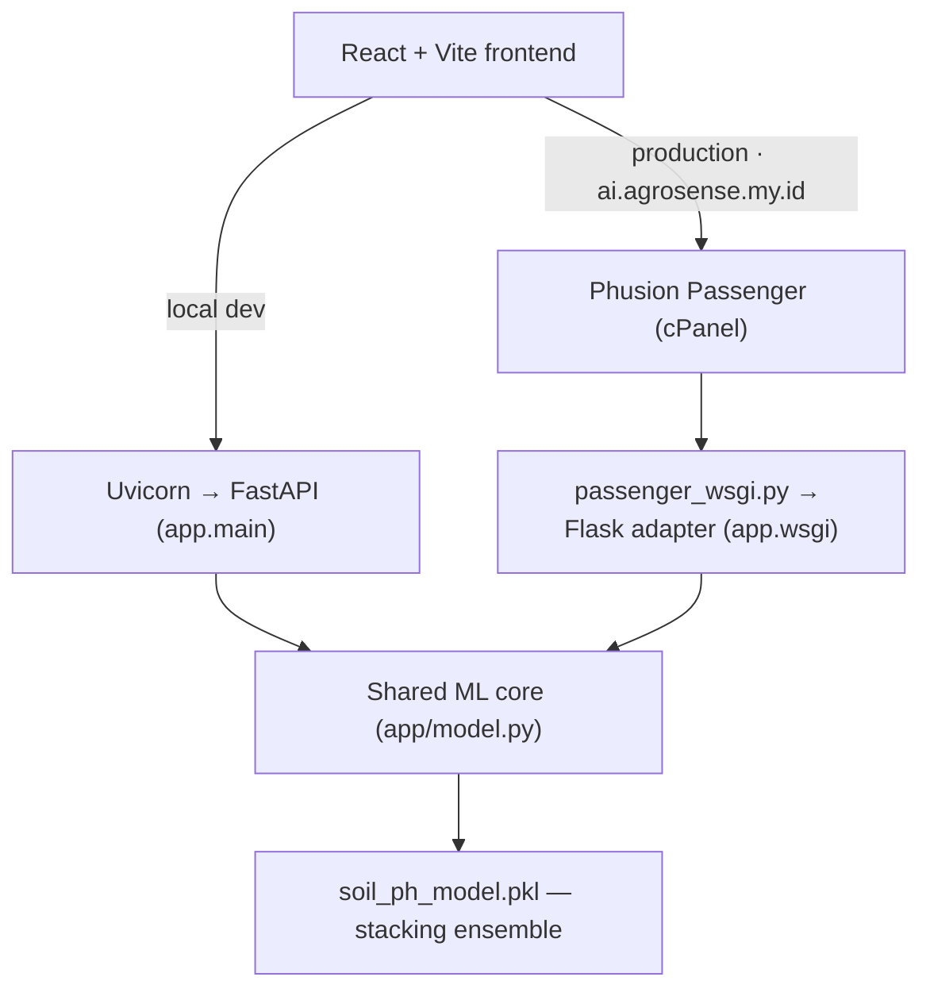

# 🌱 AgroSense

    

**AI-Assisted Soil Health Support for Sustainable Agriculture.**

AgroSense is an AI web application that classifies soil pH into five agronomic bands (Strongly Acidic, Moderately Acidic, Neutral, Moderately Alkaline, and Strongly Alkaline) based on soil measurements which includes texture, nutrients, exchangeable base cations, and soil chemistry metrics. AgroSense also pairs each prediction with an interpretation of what each pH band implies for nutrient availability and soil management which help users create agricultural decisions. It works on a single sample or on a whole field uploaded as CSV. [Click Here](https://agrosense.my.id) to access the website!

---

## ❗ Background

Healthy soil is a critical aspect to agricultural productivity. Approximately 95% of the world's food is produced in soil, while around 33% of global soils are already degraded (Food and Agriculture Organization of the United Nations [FAO], 2025).

Soil pH is particularly important because it influences nutrient availability, microbial activity, and crop growth. Strongly acidic conditions can increase the availability of aluminium and manganese to potentially toxic levels, while very alkaline soils can reduce the availability of phosphorus and several micronutrients (U.S. Department of Agriculture, Natural Resources Conservation Service [USDA NRCS], 2011).

Soil acidity is also a widespread agricultural constraint. Nearly 40% of global arable land has been estimated to be acidic, with a pH below 6.5 (Makaza et al., 2026). A global meta-analysis synthesizing 832 observations from 142 studies found that amendments applied to acidic soils increased crop yields by approximately 36% on average (Zhang et al., 2023).

Access to actionable soil information can be a challenge. In a study of 547 farmers in Central Kenya, only around 1.5% reported conducting soil testing, with laboratory distance and testing costs identified among the major barriers (Kamau et al., 2024). Laboratory analysis can also involve non-immediate turnaround. For example, University of Georgia Extension reports approximately 7–10 business days for routine soil-test results (University of Georgia Cooperative Extension, n.d.).

Therefore, AgroSense was developed as an AI-assisted decision support tool for this gap. By leveraging soil measurements available from soil analysis, AgroSense applies a trained ensemble model (XGBoost, Random Forest, Multi-Layered Perceptrons) to estimate the soil's pH category and presents the prediction together with its confidence and an accessible agronomic interpretation. With its speed and accuracy, AgroSense is designed to support soil-condition interpretation and prioritisation rather than replace laboratory soil testing.

---

## 🗂️ Project Structure

```
AgroSense/
├── frontend/                               React + Vite + Tailwind CSS for Frontend
│   ├── src/
│   │   ├── components/                     Input cards, result panel, batch upload, pH scale
│   │   ├── data/constants.js               Field ranges, tooltips, class interpretations
│   │   ├── utils/                          Range/texture validation, base-cation percentages
│   │   ├── api.js                          Client for /predict and /predict/batch
│   │   └── App.jsx                         Single/batch mode shell
│   ├── .env.example                        VITE_API_URL
│   └── package.json
├── backend/                                FastAPI + Machine Learning for Backend
│   ├── app/
│   │   ├── main.py                         FastAPI (ASGI) application — primary backend
│   │   ├── wsgi.py                         Flask WSGI adapter exposing the same routes
│   │   ├── model.py                        Shared ML core : load, feature assembly, predict
│   │   ├── schemas.py                      Pydantic request/response models and validation
│   │   ├── constants.py                    pH labels and feature/column ordering
│   │   ├── config.py                       Environment-driven settings
│   │   └── routers/                        health.py, predict.py
│   ├── models/
│   │   └── soil_ph_model.pkl               Trained stacking ensemble (XGBoost + Random Forest + Multt-Layered Perceptrons)
│   ├── passenger_wsgi.py                   cPanel/Passenger entrypoint
│   ├── requirements.txt                    Local development / ASGI dependencies
│   └── requirements-cpanel.txt             Production (Passenger/WSGI) dependencies
├── Dataset/
│   ├── Train Set.csv                       3,022 soil samples with pH class labels
│   └── Test Set.csv                        1,007 unlabelled samples
├── Notebook/
│   └── Soil pH Predictor Notebook.ipynb    Full ML workflow (EDA, Preprocessing, Feature Engineering, Modeling, Evaluation)
└── README.md
```

---

## ✨ Key Features

| Feature | Description |
| --- | --- |
| **AI Prediction** | Ensemble based model for soil pH class prediction along with the confidence percentage, shown numerically and positioned on a five-band pH scale. |
| **Agronomic Interpretation** | Each class carries an explanation of what typically drives it, how it affects nutrient availability, and which amendment approach applies |
| **Toggle Mode** | User can toggle Singular Mode to obtain a single prediction result along with the interpretation or toggle Batch Mode to obtain a batched result in CSV |
| **Data Entry** | Twelve soil measurements, includes texture (sand/silt/clay), nutrients (N, P), base chemicals (Ca, Mg, K, Na), and soil metrics (CEC, SAR, ESP) all to classify into one of five pH bands from strongly acidic to strongly alkaline |
| **Input Validation** | The system validates the user input such as input range |
| **Guidance** | Each measurements have a '?' sign that provides useful information regarding each measurements |

---

## 🛠️ Tech Stack

### Frontend

- React
- Vite
- Tailwind CSS v4
- ESLint

### Backend

- Python 3.13.4
- FastAPI (primary ASGI application)
- Uvicorn
- Flask (production WSGI compatibility adapter only)

### Data Analysis and Preprocessing
- Pandas
- NumPy
- Matplotlib
- Seaborn

### AI/Machine Learning

- Scikit-learn 1.7.2 (XGBoost 3.3.0, Random Forest, Multi-Layered Perceptrons)

### Deployment

- AnymHost (cPanel, Phusion Passenger)

---

## 🏗️ System Architecture

The frontend is a static React build that calls a single REST API — `POST /predict`, `POST /predict/batch`, and `GET /health` — at the base URL given by `VITE_API_URL`. The backend exposes those routes through two interchangeable web layers that both delegate to the same ML core in `backend/app/model.py`, which loads the joblib artifact once at startup, assembles the feature frame, and returns labels with probabilities.



FastAPI is the primary backend implementation and the target for local development, where Uvicorn also serves the generated OpenAPI docs at `/docs`. The production host runs Phusion Passenger, which starts WSGI applications rather than ASGI ones. Instead of rewriting the service, `app/wsgi.py` re-exposes the same routes as a thin Flask application reusing the same model core, schemas, and constants, and `passenger_wsgi.py` mounts it as the Passenger entrypoint. The Flask layer adds no prediction logic of its own — it only translates requests and errors between Flask and the shared core.

`passenger_wsgi.py` also pins the BLAS/OpenMP thread counts to one and enables `AGROSENSE_LIMIT_PARALLELISM`, which forces `n_jobs=1` on the ensemble's estimators so the model stays within the process and memory limits of shared hosting. Allowed browser origins are configured through `CORS_ORIGINS` in both layers.

### Machine Learning Layer

The served artifact is a scikit-learn `StackingClassifier` combining three base learners — a standardised multi-layer perceptron (256×128), a random forest (300 trees, depth 10, balanced class weights), and an XGBoost classifier (300 estimators) — under a logistic-regression meta-learner trained with 5-fold stratified cross-validation.

It takes fourteen features: the eleven measured inputs `P, SAND, CLAY, N, K, Ca, Mg, Na, CEC, SAR, ESP` plus the engineered base-cation saturations `% Ca, % Mg, % K` (silt is collected in the form for the texture check but was dropped during feature selection). Output is one of five ordinal pH classes (strongly acidic → strongly alkaline), with the class probability returned as the confidence score. On the held-out split of the balanced training data, the final tuned ensemble reaches 0.89 accuracy and 0.89 macro F1.

Data exploration, outlier handling, imputation, feature engineering and selection, the model experiments, and the full evaluation are documented in `Notebook/Soil pH Predictor Notebook.ipynb`.

---

## 💻 Local Setup

**Clone**

```bash
git clone https://github.com/utinn/AgroSense---AI-Assisted-Soil-Health-Support-for-Sustainable-Agriculture.git
cd AgroSense---AI-Assisted-Soil-Health-Support-for-Sustainable-Agriculture
```

**Backend**

```bash
cd backend
python -m venv .venv
source .venv/bin/activate        # Windows: .venv\Scripts\activate
pip install -r requirements.txt
cp .env.example .env
uvicorn app.main:app --reload
```

The API comes up on `http://127.0.0.1:8000`, with interactive docs at `/docs`. Run Uvicorn from `backend/` so the default relative `MODEL_PATH` resolves. Use `requirements.txt` for local work — `requirements-cpanel.txt` targets the production Passenger environment and installs Flask instead of FastAPI/Uvicorn.

**Frontend**

```bash
cd frontend
npm install
npm run dev
```

Vite serves the app on `http://localhost:5173`.

**Environment variables**

- `backend/.env.example` → `MODEL_PATH` (path to the joblib artifact, relative to `backend/`), `CORS_ORIGINS` (comma-separated allowed origins, already set to the two Vite localhost origins), and `AGROSENSE_LIMIT_PARALLELISM` (single-threaded estimators; keep `false` locally).
- `frontend/.env.example` → `VITE_API_URL`, which points at the production API. For local development, leave it unset so the client falls back to `http://localhost:8000`, or set it explicitly to your local backend.

No secrets are required to run the project locally.

---

## ❌ Limitations

- The model predicts a pH **band** instead of a pH value. Also, the result depends on lab-measured inputs which includes CEC, SAR, ESP, and exchangeable cations. It narrows down what a soil is likely doing and it does not fully replace laboratory testing.
- The model is limited on handling extreme inputs. Data preprocessing removed extreme outliers to reduce their influence on training and bring balance to the data distribution. As a result, the model has limited exposure to observations far outside the training distribution, and predictions for unusually extreme soil measurements may be unreliable which is also the reason AgroSense has a fixed range of input
- AgroSense can only give static interpretation, which means that the current explanation is assigned at the predicted pH-class level. Samples classified into the same category receive the same general interpretation regardless of which features most strongly influenced the prediction. As a result, the explanation describes the class rather than the specific reasoning behind an individual prediction.

---

## 🚀 Future Improvements

- Adding the top most influential measurement for each predicted samples (using SHAP), allowing the user to understand which soil measurements that drives most of the result
- Improve the model robustness to extreme inputs.
- Expand the dataset used to train the model by increasing both the quantity and diversity of labelled soil samples to better represent different soil conditions and pH classes, thus improving the model's generalization and robustness on unseen data.

---

## ⚠️ Disclaimer

This application is for **research and educational purposes** only. It should NOT be used for real agricultural decision making without proper analysis and validation.

---

## 📚 References

Food and Agriculture Organization of the United Nations. (2025, June 17). How healthy soils combat climate change and boost food security. FAO article

Kamau, P., Ndirangu, I., Richardson, S., Pamme, N., & Gitaka, J. (2024). Gendered farmer perceptions towards soil nutrition and willingness to pay for a cafetière-style filter system for in-situ soil testing: Evidence from Central Kenya. Heliyon, 10(18), e37568. [https://doi.org/10.1016/j.heliyon.2024.e37568](https://doi.org/10.1016/j.heliyon.2024.e37568)

Makaza, W., Khiari, L., & El Achaby, M. (2026). The meta-analysis study on the effects of the quality of lime materials on the soil physicochemical properties and crop yields in acid soils. Frontiers in Soil Science, 6, Article 1725559. [https://doi.org/10.3389/fsoil.2026.1725559](https://doi.org/10.3389/fsoil.2026.1725559)

U.S. Department of Agriculture, Natural Resources Conservation Service. (2011). Soil quality indicators: Soil pH. USDA NRCS soil pH technical sheet

University of Georgia Cooperative Extension. (n.d.). Soil testing. UGA Extension soil testing page

Zhang, S., Zhu, Q., de Vries, W., Ros, G. H., Chen, X., Muneer, M. A., Zhang, F., & Wu, L. (2023). Effects of soil amendments on soil acidity and crop yields in acidic soils: A world-wide meta-analysis. Journal of Environmental Management, 345, Article 118531. [https://doi.org/10.1016/j.jenvman.2023.118531](https://doi.org/10.1016/j.jenvman.2023.118531)
